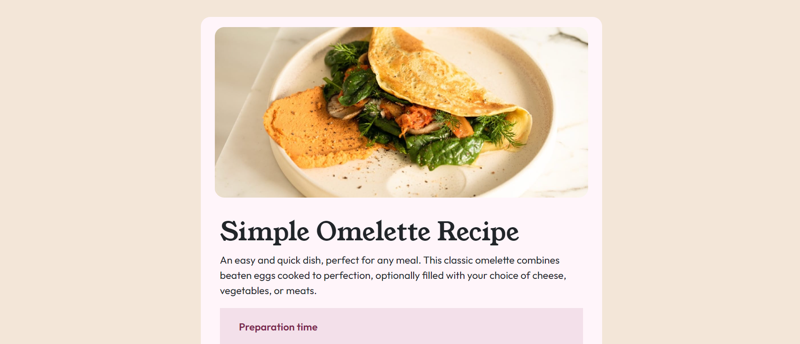

# Frontend Mentor - Recipe page solution

This is a solution to the [Recipe page challenge on Frontend Mentor](https://www.frontendmentor.io/challenges/recipe-page-KiTsR8QQKm).

## Table of contents

- [Frontend Mentor - Recipe page solution](#frontend-mentor---recipe-page-solution)
  - [Table of contents](#table-of-contents)
  - [Overview](#overview)
    - [Screenshot](#screenshot)
    - [Links](#links)
  - [My process](#my-process)
    - [Built with](#built-with)
    - [What I learned](#what-i-learned)
  - [Author](#author)

## Overview

### Screenshot

### Links

- Solution URL: [URL here](https://github.com/nabbysidek/recipe-page)
- Live Site URL: [URL here](https://nabbysidek.github.io/recipe-page/)

## My process

### Built with

- Semantic HTML5 markup
- CSS custom properties
- Bootstrap
- Mobile-first workflow

### What I learned

Working on this project with a mobile-first workflow for the first time has been an enlightening experience. Adopting this approach, I focused on designing the mobile version of the website before scaling up to larger screens. This method emphasized the importance of simplicity and prioritizing essential content, ensuring a clean and efficient user experience on small devices. It also helped me identify and address potential layout issues early in the development process. Additionally, I gained a deeper understanding of responsive design principles and CSS media queries, which are crucial for creating a seamless and adaptive web experience across different devices. Overall, the mobile-first workflow has equipped me with new skills and a fresh perspective on web design, ultimately making me a more versatile and effective developer.

## Author

- Linkedin - [Aina Balqis](https://www.linkedin.com/in/nabbysidek/)
- Frontend Mentor - [@nabbysidek](https://www.frontendmentor.io/profile/nabbysidek)

